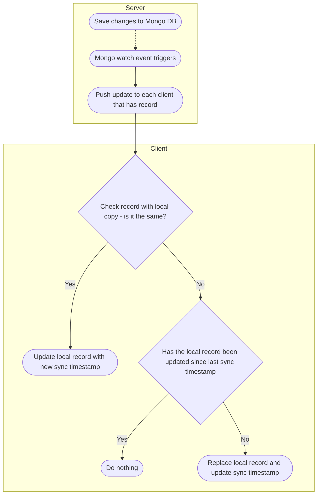
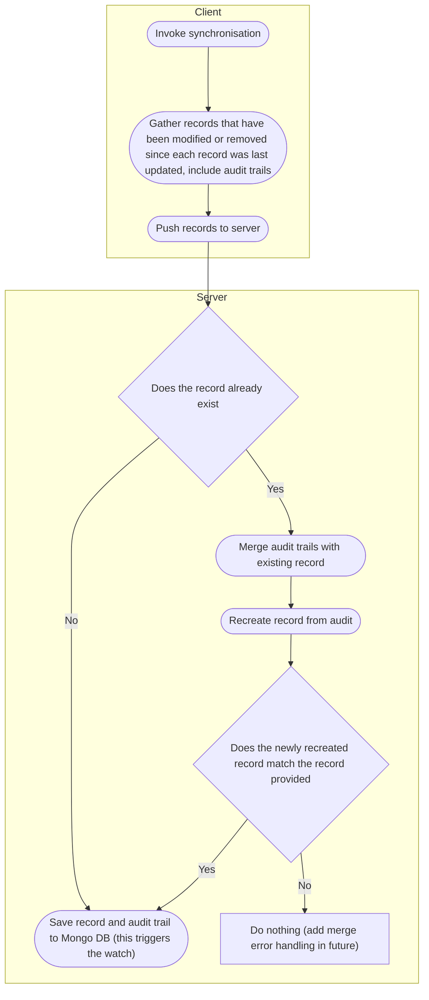

## Mongo Watch Process



```mermaid
flowchart TD  
  subgraph server [Server]
    saveToMongo([Save changes to Mongo DB])
    watchEvent([Mongo watch event triggers])
    pushEvent([Push update to each client that has record])
  end
  subgraph client [Client]
    checkRecord{Check record with local copy - is it the same?}
    updateLocalSyncTimestamp([Update local record with new sync timestamp])
    isLocalUpdated{Has the local record been updated since last sync timestamp}
    doNothing([Do nothing])
    replaceRecord([Replace local record and update sync timestamp])
  end

  saveToMongo-.->watchEvent
  watchEvent-->pushEvent  
  pushEvent-->checkRecord
  checkRecord-->|Yes|updateLocalSyncTimestamp
  checkRecord-->|No|isLocalUpdated
  isLocalUpdated-->|Yes|doNothing
  isLocalUpdated-->|No|replaceRecord
```

## Sync Process


```mermaid
flowchart TD
  subgraph client [Client]
    invokeSync([Invoke synchronisation])
    gatherRecords([Gather records that have been modified or removed since each record was last updated, include audit trails])
    pushToServer([Push records to server])
  end
  subgraph server [Server]
    hasExisting{Does the record already exist}
    mergeAudit([Merge audit trails with existing record])
    saveRecord(["Save record and audit trail to Mongo DB (this triggers the watch)"])
    recreateFromAudit([Recreate record from audit])
    doesAuditAndRecordAlign{Does the newly recreated record match the record provided}
    doNothing["Do nothing (add merge error handling in future)"]
  end

  invokeSync--->gatherRecords
  gatherRecords-->pushToServer
  pushToServer-->hasExisting
  hasExisting-->|Yes|mergeAudit
  hasExisting-->|No|saveRecord
  mergeAudit-->recreateFromAudit
  recreateFromAudit-->doesAuditAndRecordAlign
  doesAuditAndRecordAlign-->|Yes|saveRecord
  doesAuditAndRecordAlign-->|No|doNothing
```

## Upsert Process

```mermaid

```